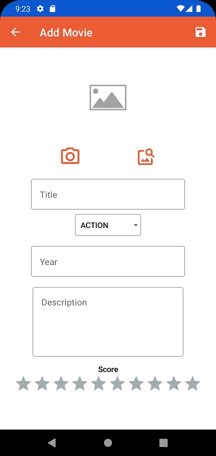
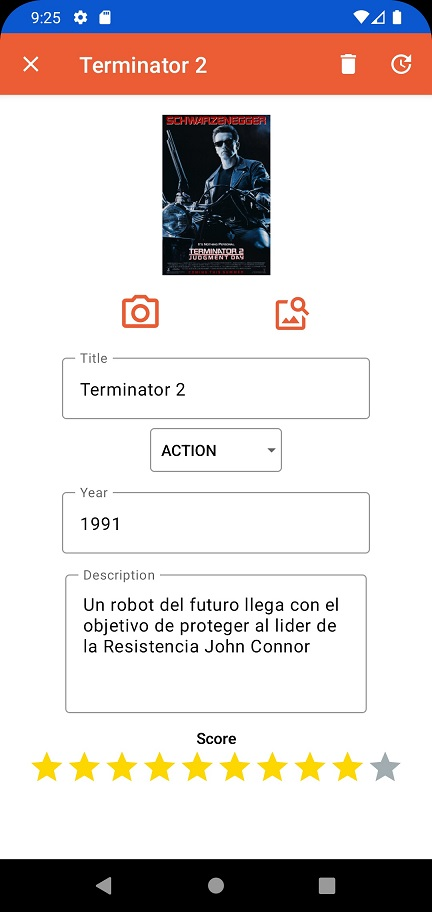

# AS-Compose-MVVM-MyMovies
Una aplicación sencilla para películas que maneja base de datos Room (operaciones CRUD), usando Jetpack Compose.

## Architecture Used
MVVM Architecture

## Libraries
- Hilt
- Navigation Compose
- Room
- Coil
- Coroutines

## Output
 ### Splash Screen

 ### Main Screen

 ### Add Movie Screen

 ### Update Movie Screen

 ### Search Screen

